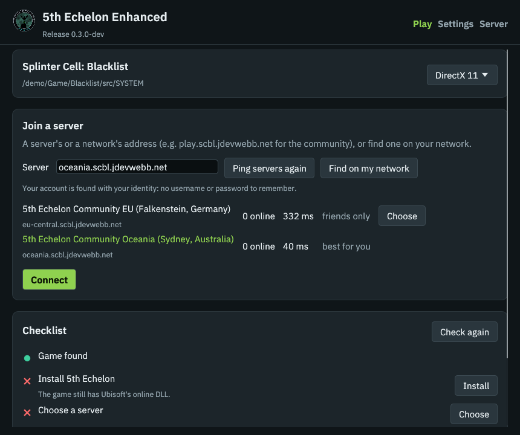
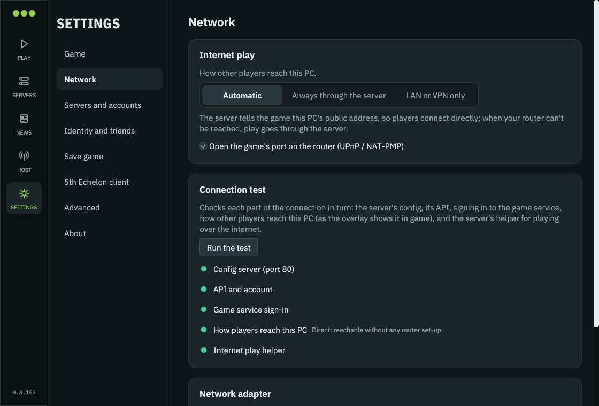
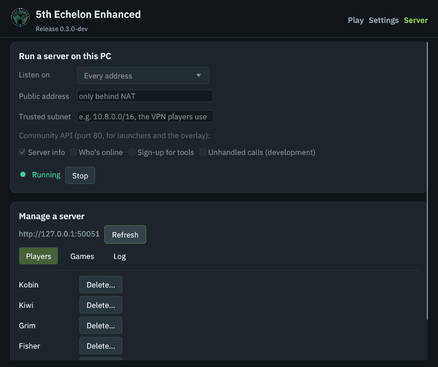

<p align="center">
  
</p>

<h1 align="center">5th Echelon Enhanced</h1>

<p align="center">
  <b>Community servers for <i>Tom Clancy's Splinter Cell: Blacklist</i> multiplayer, and a launcher that sets the game up for you.</b><br>
  Co-op and Spies vs Mercs, years after the official servers went dark.
</p>

<p align="center">
  <a href="#play-in-five-minutes">Play</a> ·
  <a href="#linux-and-steam-deck">Linux &amp; Steam Deck</a> ·
  <a href="#host-a-server">Host a server</a> ·
  <a href="#features">Features</a> ·
  <a href="#whats-new-in-this-fork">What's new</a> ·
  <a href="#contributing">Contribute</a> ·
  <a href="#community">Community</a>
</p>

---

## Standing on the shoulders of

**5th Echelon Enhanced is a fork of [5th Echelon](https://github.com/unixoide/5th-echelon) by [unixoide](https://github.com/unixoide).** They reverse-engineered the game's Quazal online stack, wrote the server, the launcher and the game hook, and documented the protocols in the [5th Echelon reference](https://unixoide.github.io/5th-echelon). None of this fork would exist without that work.

### Authors and contributors

| | Contribution |
|---|---|
| **[unixoide](https://github.com/unixoide)** | Created 5th Echelon: the dedicated server, the Quazal/PRUDP/RMC implementation, the launcher, the game hook and the protocol research |
| **[Matthias Walther (MPW1412)](https://github.com/MPW1412)** | Invites into private matches, worked out in the game itself ([#123](https://github.com/unixoide/5th-echelon/pull/123)); the DLL version parser building on any OS ([#124](https://github.com/unixoide/5th-echelon/pull/124)); the Linux findings on CD keys and many-core CPUs ([#98](https://github.com/unixoide/5th-echelon/issues/98)) |
| **[Thiago (Thiagogob)](https://github.com/Thiagogob)** | Found why the game says "service not available" under Wine/Proton, and fixed it by emulating the network check Wine lacks ([#128](https://github.com/unixoide/5th-echelon/pull/128)); the reason Linux and Steam Deck work |
| **[Sergey P. (ThirteenAG)](https://github.com/ThirteenAG)** | Contributions to upstream 5th Echelon |
| **[koteykaby](https://github.com/koteykaby)** | Contributions to upstream 5th Echelon |
| **[Michał Kapała (michal-kapala)](https://github.com/michal-kapala)** | Contributions to upstream 5th Echelon, and co-author of [GROBackendWV](https://github.com/zeroKilo/GROBackendWV) |
| **[Askorbinovaya Kislota](https://github.com/askorbinovaya-kislota)** | Contributions to upstream 5th Echelon |
| **[zeroKilo](https://github.com/zeroKilo)** | [GROBackendWV](https://github.com/zeroKilo/GROBackendWV), which shares parts of the protocol and helped get 5th Echelon started |
| **[JDevWebb](https://github.com/JDevWebb)** | This fork: the new launcher, automatic setup, server hardening and the community API |

Every upstream commit keeps its original author in this repository's history, and merged pull requests keep their authors' commits. The [changelog](#whats-new-in-this-fork) lists what this fork changed and where each change came from.

Also used: [IBM Plex Sans](https://github.com/IBM/plex) (SIL Open Font License) for the overlay and launcher, [egui](https://github.com/emilk/egui) for the launcher, and [hudhook](https://github.com/veeenu/hudhook) with [Dear ImGui](https://github.com/ocornut/imgui) for the overlay.

**Want your name here?** See [Contributing](#contributing). Fixes, testing reports, research and documentation all count.

### Become a collaborator

Want to help run this project: review pull requests, triage issues, test releases, or work on it directly? [Open an issue](https://github.com/JDevWebb/5th-echelon-enhanced/issues/new) saying a little about yourself and what you'd like to help with. We'll gladly add you as a collaborator.

---

## Play in five minutes

You need **Splinter Cell: Blacklist on PC** (Steam or Ubisoft Connect) and **Windows 10 or 11**. On Linux or a Steam Deck, see [Linux and Steam Deck](#linux-and-steam-deck).

1. **Download `launcher.exe`** from the [latest release](https://github.com/JDevWebb/5th-echelon-enhanced/releases/latest). It's one file; put it anywhere.
2. **Run it.** It finds the game on its own: Steam libraries, Ubisoft Connect, and the usual folders on every drive. If it can't, choose the folder with `Blacklist_game.exe`; it remembers it.
3. **Join a server.**
   - Enter the address your community gave you, or press **Find on my network**.
   - Pick a name, or tick **I already have an account on this server**.
   - Press **Set up**.
4. **Press Play.**

<p align="center">
  
</p>

**What Set up does for you:**
- installs the 5th Echelon client into the game, keeping the game's own file so you can undo it;
- checks the server answers;
- creates your account, or signs you in;
- picks the network adapter other players can reach you on;
- makes a rank 5 save so co-op and Spies vs Mercs are unlocked.

The **checklist** keeps an eye on all of this. Anything that goes wrong later (a VPN that's off, an update) shows up there with a button that fixes it.

> [!TIP]
> **Playing over a VPN** (Radmin VPN, ZeroTier, Tailscale, …)? Connect to it before pressing Set up. The launcher then pins the VPN adapter, so friends can join your matches. **Settings › Network › Don't start the game without this adapter** stops the game quietly using the wrong network when the VPN is off.

### In the game

Press <kbd>F5</kbd> for the overlay:
- **Players:** everyone on the server and who's online, with invite buttons. It also shows what they're playing, on servers that share it.
- **Invites:** accept one and you go straight into that match.
- **Match:** change the lobby's minimum and maximum players. For example, co-op with more than two, or Spies vs Mercs with fewer than four.
- **Server:** which server you're on, and **Sign in again**.

Invites also pop up as notifications.

### When something doesn't work

1. **Look at the checklist** on the Play screen and press the button next to anything red.
2. **Run Settings › Connection test.** It checks each part in turn: the server's config (port 80), its API (50051), signing in to the game service (21126), and whether the server can reach your PC directly.
3. **The game's log** is `bl-tracing.log` in the game folder; the previous game's is `bl-tracing.prev.log`. Include it when you ask for help.

<p align="center">
  
</p>

---

## Linux and Steam Deck

The game runs under Proton (Steam) or Wine (Lutris, Heroic, …), and 5th Echelon works there too. The client detects Wine and fixes what Wine leaves out:
- the network check behind "The Splinter Cell Blacklist service is not available";
- starting without Ubisoft Connect.

### With the Linux launcher (recommended)

1. **Download `launcher-linux-x86_64`** from the [latest release](https://github.com/JDevWebb/5th-echelon-enhanced/releases/latest) and make it executable:
   ```sh
   chmod +x launcher-linux-x86_64 && ./launcher-linux-x86_64
   ```
   On a Steam Deck, do this in **Desktop Mode**.
2. **If you've never started the game on this PC, start it once from Steam and quit.** Proton only creates the game's Wine files on its first run, and your save goes in there; the checklist reminds you.
3. **Join a server and press Set up**, as on Windows. The launcher finds the game in any Steam library (native, Flatpak or Snap, SD card included), or in Lutris, Heroic and `~/.wine` prefixes. You can also choose the folder yourself.
4. **Press Play.**
   - Steam games start through Steam, with Proton.
   - Other installs start with `wine` in their own prefix, or from the app you installed them with.

**On a Steam Deck,** you only need Desktop Mode for the setup. The client is installed in the game's own folder, so afterwards just play from your library in **Game Mode**.

> [!IMPORTANT]
> **CPUs with more than 16 threads:** under Wine the game can freeze at start, with or without 5th Echelon. The launcher's checklist and Settings show the fix: a Steam launch option (Properties › Launch options), with a Copy button:
> ```
> WINE_CPU_TOPOLOGY=16:0,1,2,3,4,5,6,7,8,9,10,11,12,13,14,15 %command%
> ```
> The launcher sets it by itself when it starts the game with Wine.

### With `launcher.exe` inside Proton

The Windows launcher also runs under Proton:
1. Add it to Steam as a non-Steam game, next to the game.
2. Make it use **the game's own prefix**, so settings and saves end up where the game looks. Set its launch options to:
   ```
   STEAM_COMPAT_DATA_PATH="<your Steam library>/steamapps/compatdata/235600" %command%
   ```

It then starts the game directly, CPU fix included. (This route hasn't been tested as much as the Linux launcher; reports are welcome.)

### Without a launcher

Everything the launcher does can be done by hand:
1. Put `uplay_r1_loader.dll` from a release in the game's `src/SYSTEM` folder, after renaming the game's own to `uplay_r1_loader.orig.dll`.
2. Write `uplay.toml` there, or `uplay.override.toml` (see [below](#setting-up-the-game-from-another-tool)), with the server and your account.

---

## Features

### For players
- **Online co-op and Spies vs Mercs:**
  - matchmaking through Find Teammate and Quick Match;
  - lobby invites;
  - **invites into private matches**.
- **An automatic setup:** game detection, client install, one-click accounts, network adapter pinning and a rank 5 save, then a checklist with a fix for each problem.
- **An in-game overlay** (<kbd>F5</kbd>): players and who's online, invites, lobby player limits, and server status.
- **Save games:**
  - a rank 5 save for new players;
  - raising an existing save to rank 5 (with a backup first);
  - importing your Ubisoft Connect save;
  - backups.
- **Staying signed in:**
  - the client signs in again on its own if the server restarts or your sign-in lapses;
  - logins survive server restarts.
- **Updates:** the launcher updates itself from this project's releases, checking every download against the published SHA-256 checksums.
- **Linux and Steam Deck:** a native Linux launcher, Proton and Wine support in the client, and the many-core CPU fix.
- **Unusual game builds:** unknown game executables can be identified from the launcher, which covers most mods.

### For server operators
- **One server for everything:** accounts, matchmaking, invites, friends and presence, news, challenges, and the game's configuration and content.
- **Runs anywhere:**
  - Windows, from the launcher's **Server** screen or on its own;
  - Linux;
  - Docker.
- **A management screen** in the launcher: see and remove players and games, and read the log. It works for the server on your PC or any server with its admin key.
- **Built for the public internet:**
  - rate limits on logins and new accounts;
  - login tickets that expire;
  - only a match's own players can change it;
  - a protected admin API;
  - a malformed packet can't crash it.
- **Fixes joins over VPNs:** `trusted_subnet` corrects players who advertise the wrong network adapter.
- **A community API** on port 80, each part opt-in: server info, who's online, one-click accounts.

---

## Host a server

Players need to reach these ports on the server:

| Port | Protocol | What |
|---|---|---|
| 80 | TCP | The game's online configuration, and the community API. **The game always uses port 80.** |
| 8000 | TCP | Content (multiplayer balancing) |
| 21126 | UDP | Game login |
| 21127 | UDP | Game service |
| 50051 | TCP | Accounts, friends and invites (the launcher and overlay) |

Matches themselves run **peer to peer** between players, not through the server.

**The public address** is the one thing every server needs set: the address players connect to. Without it, the server tells players to connect to `127.0.0.1`. Use:
- your **public IP**, with the ports above forwarded to the server;
- or the server's **VPN address**, if everyone plays over one VPN.

### On Windows: from the launcher (easiest)

1. Open the launcher's **Server** screen. If `dedicated_server.exe` isn't next to the launcher, press **Download the server**.
2. Choose what to **listen on** (every address is fine), and fill in the **public address** if players come in through port forwarding.
3. Switch on the community API parts you want, then press **Start server**.

The launcher stops the server when it closes. The **Manage a server** section lists players and games, and shows the log.

<p align="center">
  
</p>

### On Windows: on its own

For a server that keeps running without the launcher (e.g. as a scheduled task or service):

1. Put `dedicated_server.exe` from the [release](https://github.com/JDevWebb/5th-echelon-enhanced/releases/latest) in its own folder, e.g. `C:\5th-echelon`.
2. Allow the ports through Windows Firewall, from an administrator PowerShell:
   ```powershell
   New-NetFirewallRule -DisplayName "5th Echelon (TCP)" -Direction Inbound -Protocol TCP -LocalPort 80,8000,50051 -Action Allow
   New-NetFirewallRule -DisplayName "5th Echelon (UDP)" -Direction Inbound -Protocol UDP -LocalPort 21126,21127 -Action Allow
   ```
3. Start it from that folder with the address players connect to:
   ```powershell
   cd C:\5th-echelon
   .\dedicated_server.exe --public-address 203.0.113.10
   ```

The first start writes `service.toml` (the settings) and creates the database, keys and `data\` folder next to it.

### On Linux

1. Download `dedicated_server-linux-x86_64` from the [release](https://github.com/JDevWebb/5th-echelon-enhanced/releases/latest), or [build it](#build-from-source).
2. Give it a folder and a user of its own:
   ```sh
   sudo useradd --system --home /srv/5th-echelon --create-home 5th-echelon
   sudo install -m 755 dedicated_server-linux-x86_64 /srv/5th-echelon/dedicated_server
   ```
3. Port 80 is privileged. Let the server bind it without running as root:
   ```sh
   sudo setcap cap_net_bind_service=+ep /srv/5th-echelon/dedicated_server
   ```
4. Run it under systemd, as `/etc/systemd/system/5th-echelon.service`:
   ```ini
   [Unit]
   Description=5th Echelon server
   After=network-online.target
   Wants=network-online.target

   [Service]
   User=5th-echelon
   WorkingDirectory=/srv/5th-echelon
   Environment=FE_PUBLIC_ADDRESS=203.0.113.10
   ExecStart=/srv/5th-echelon/dedicated_server
   Restart=always

   [Install]
   WantedBy=multi-user.target
   ```
   ```sh
   sudo systemctl enable --now 5th-echelon
   journalctl -u 5th-echelon -f
   ```
5. Open the ports in your firewall, e.g. with ufw:
   ```sh
   sudo ufw allow 80,8000,50051/tcp && sudo ufw allow 21126,21127/udp
   ```

The server exits if one of its services stops, so systemd's `Restart=always` brings it straight back.

### With Docker

Every release publishes the server's image to GitHub's container registry:

```sh
docker run -d --name 5th-echelon --restart unless-stopped \
  -e FE_PUBLIC_ADDRESS=203.0.113.10 \
  -p 80:80 -p 8000:8000 -p 21126:21126/udp -p 21127:21127/udp -p 50051:50051 \
  -v 5th-echelon:/srv/5th-echelon \
  ghcr.io/jdevwebb/5th-echelon-server:latest
```

Or build it yourself with Compose, from a clone of this repository:

```sh
FE_PUBLIC_ADDRESS=203.0.113.10 docker compose -f docker/compose.yaml up -d
docker compose -f docker/compose.yaml logs -f
```

- It builds the server from source, publishes the ports above, and keeps everything it writes in the `data` volume: the database, keys, `service.toml` and `data/`. Nothing is lost when the container is rebuilt.
- The image has a health check on the API port.
- `FE_LISTEN` (default: every address) chooses the address to listen on.

To edit the settings, change `service.toml` in the volume and restart:

```sh
docker compose -f docker/compose.yaml exec server sh -c 'cat service.toml'
docker compose -f docker/compose.yaml restart
```

### Settings

The server reads `service.toml` from its working folder, writing the defaults on the first start. The settings this fork adds are in **[docs/server-settings.md](docs/server-settings.md)**:

- **`[community_api]`:** server info, who's online, one-click accounts, unhandled calls. Only server info is on by default.
- **`trusted_subnet`:** fixes joins when players' games advertise the wrong network adapter (e.g. everyone on one VPN).
- **`[limits]`:** failed logins and new accounts per address.
- **`[admin]`:** the admin API for the launcher's **Manage a server**. Its key is written to `admin-key.txt`.

Command-line options: `--public-address <ip>`, `--listen <ip>`, and `-c <file>` for another settings file. The first two are also the `FE_PUBLIC_ADDRESS` and `FE_LISTEN` environment variables. The address options rewrite `service.toml` on every start, so the addresses always match.

---

## What's new in this fork

Compared with upstream [5th Echelon 0.2.5](https://github.com/unixoide/5th-echelon/releases/tag/v0.2.5):

**Launcher**
- Rewritten in egui around a new `setup` library, for Windows and Linux (Steam, Flatpak, Steam Deck, Lutris, Heroic).
- Automatic setup, a checklist with fixes, and one-click accounts.
- Adapter pinning that works (upstream's saved a value that never matched an adapter).
- Server management, and verified updates from this fork's releases.
- Settings are never silently reset: an unreadable file is kept as `uplay.toml.broken`, and outside changes are merged rather than overwritten.
- No sample accounts; DirectX 11 by default.

**Invites and matches**
- Invites into private matches, from [#123](https://github.com/unixoide/5th-echelon/pull/123) by Matthias Walther, with follow-up fixes:
  - pushes are resent until acknowledged;
  - duplicate packets are answered, not handled twice.
- Leaving and abandoning a session removes the player, and empty sessions end.
- The `trusted_subnet` address fix for VPN play.

**Server stability and security**
- Crashes fixed:
  - bad packets can no longer take the server down;
  - a failed service restarts the process instead of leaving it half-alive;
  - matchmaking no longer panics on odd data.
- Logins survive restarts (the token keys are kept).
- Plain logins can no longer sign in as someone else; sample accounts are disabled.
- Presence works; memory no longer grows without bound; the HTTP servers handle connections in parallel, with timeouts.
- Rate limits, expiring tickets, session owner checks, and a constant-time admin key check.
- An opt-in admin API setting, and gRPC reflection off by default.

**Game client**
- Works under Wine and Proton:
  - the network check Wine lacks is emulated ([#128](https://github.com/unixoide/5th-echelon/pull/128) by Thiago);
  - it starts without Ubisoft Connect there;
  - its network runtime uses two threads instead of one per CPU core.
- Signs in again on its own when the server says it's signed out.
- Crash fixes in the hook.
- `uplay.override.toml`, for tools that set up the game (see below).
- A redesigned overlay.

**Tooling**
- Docker builds for Linux and Windows (`build/build.sh`), and a Docker image for the server.
- Headless test players (`tools/testbot`) that play through logins, lobby and private-match invites, and packet loss against a real server.

### Setting up the game from another tool

Tools that set up the game (an installer, a VPN client, a community's own app) can write `uplay.override.toml` next to `uplay.toml`. It sets:
- the server (`ConfigServer`, `ApiServer`);
- the account (`[User]`);
- the network pin (`[Networking]`);
- optionally `[Managed] By = "Tool name"` and `HelpText`.

The hook applies it on every start, even if the launcher has never run. With `[Managed]` set, the launcher shows the install as managed by that tool and doesn't change its settings.

---

## Build from source

The simplest way needs only Docker, on Windows, macOS or Linux:

```sh
build/build.sh test       # workspace tests
build/build.sh bots       # test players against a fresh local server
build/build.sh server     # dist/dedicated_server-linux-x86_64
build/build.sh windows    # dist/launcher.exe (client DLL inside), uplay_r1_loader.dll, dedicated_server.exe
build/build.sh linux      # dist/launcher-linux-x86_64 (client DLL inside), dedicated_server-linux-x86_64
build/build.sh sums       # dist/SHA256SUMS, for a release
```

To build natively instead, install [rustup](https://rustup.rs) (the toolchain in `rust-toolchain.toml` installs itself) and the [Protobuf compiler](https://github.com/protocolbuffers/protobuf/releases/latest) (`protoc` on your `PATH`, or `PROTOC` pointing at it). Then:

```sh
cargo build --release -p dedicated_server                      # the server, for your OS
cargo build --release -p launcher --features embed-dll         # on Windows: builds the client DLL and embeds it
```

### Releases and CI

GitHub Actions tests and builds every push and pull request (Linux tests, the test players, and the Windows and Linux builds). Releases are published by pushing a version tag:

1. Set `version` in `release.toml` (e.g. `0.3.1`) and commit it.
2. Tag and push:
   ```sh
   git tag v0.3.1 && git push origin main v0.3.1
   ```

The release workflow then:
- builds every download on Windows and Linux runners;
- writes `SHA256SUMS`, which the launcher's updater checks against;
- publishes the GitHub release;
- pushes the server image to `ghcr.io`.

A tag with a suffix (`v0.3.1-rc.1`) makes a pre-release, which the updater doesn't offer.

### Project layout

| Folder | What |
|---|---|
| `dedicated_server/` | The server: Quazal services, the game's protocols, the gRPC API and the community API |
| `quazal/` | The PRUDP/RMC network stack |
| `hooks/` | The game client (`uplay_r1_loader.dll`): Uplay emulation, network fixes and the overlay |
| `setup/` | The launcher's logic: finding the game, installing, accounts, saves and checks |
| `launcher/` | The launcher's egui interface (Windows and Linux) |
| `api/` | The gRPC API definitions |
| `tools/` | Test players, the DDL parser, Wireshark dissectors, and research tools |
| `docker/` | The server's Docker image and compose file |
| `.github/workflows/` | CI (`ci.yml`) and releases (`release.yml`) |

### Research tools

- **DDL parser:** reads the game's protocol definitions out of an executable:
  ```sh
  cargo run --release -p quazal-tools --bin ddl-parser -- -i mapping.json -o ddls.json path/to/exe
  ```
- **Wireshark dissectors:**
  - PRUDP/RMC, in Rust: `scripts/build_dissector.sh`.
  - A Lua dissector with the DO protocol: copy `tools/quazal.lua`, `tools/dormc.txt` and `tools/rmc.txt` to Wireshark's plugin folder.
  - A basic Lua dissector for Storm (P2P).

  For example:
  ```sh
  tshark -r capture.pcapng -d udp.port==3074,prudp -d udp.port==13000,prudp -V -O prudp,rmc
  ```

---

## Contributing

Contributions of every size are welcome: bug reports with logs, testing with friends, protocol research, documentation, and code.

- **Bugs:** open an issue with what you did, what happened, and the game's `bl-tracing.log` (look it over for anything private before posting it). For server problems, add the server's `server.log.json` or console output.
- **Pull requests:** keep them focused, and describe how you tested.
  - CI builds and tests every pull request on Linux and Windows. Run `build/build.sh test` and, for server changes, `build/build.sh bots` locally first (add a scenario to `tools/testbot` for new server behaviour). Format with `build/build.sh fmt`.
  - Changes that affect the game should say whether they were tried in the game itself.
- **Credit:** your commits keep your name, and you'll be listed under [Authors and contributors](#authors-and-contributors).
- **Upstream:** fixes that apply to upstream 5th Echelon are offered there as well.
- **Collaborators:** see [Become a collaborator](#become-a-collaborator).

Never commit game files or anything extracted from them. Facts learned from the game (IDs, names, protocol layouts) are fine.

---

## Community

Find other players, active servers and help:

- [Spy vs Merc Community](https://discord.com/invite/YgccjKPUNm)
- [Splinter Cell Community Hub](https://discord.com/invite/ubX9D9v)
- [/r/SplinterCell](https://discord.gg/ywdszwF)
- [SCBL Multiplayer](https://discord.gg/uJH5Sv5Zw3)

## Licence

**This fork's own work is under the MIT licence; upstream's code isn't licensed yet.** [LICENSE.md](LICENSE.md) says exactly what's covered:

- **MIT:** files this fork created (such as `setup/`, the new launcher screens, the community API, rate limits, the test players, builds and Docker), and this fork's changes to every other file.
- **Not MIT:**
  - upstream 5th Echelon's code, which has no licence yet ([unixoide/5th-echelon#129](https://github.com/unixoide/5th-echelon/issues/129)) and remains its authors';
  - code merged from others' pull requests, which stays theirs;
  - the fonts (SIL Open Font License), and upstream's logo and images.

Contributions are accepted under MIT unless a pull request says otherwise.

*Splinter Cell and Splinter Cell: Blacklist are trademarks of Ubisoft Entertainment. This project is not affiliated with or endorsed by Ubisoft, and ships no game files: you need your own copy of the game.*
