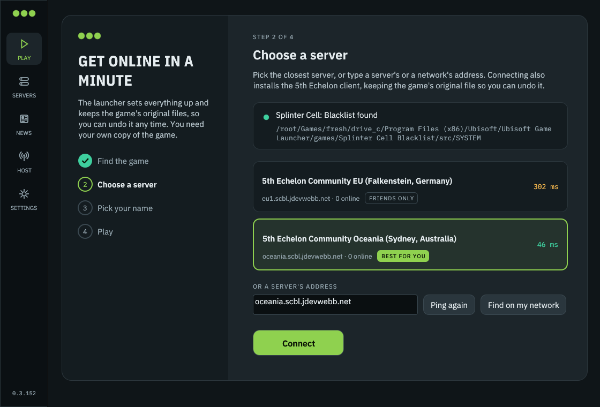
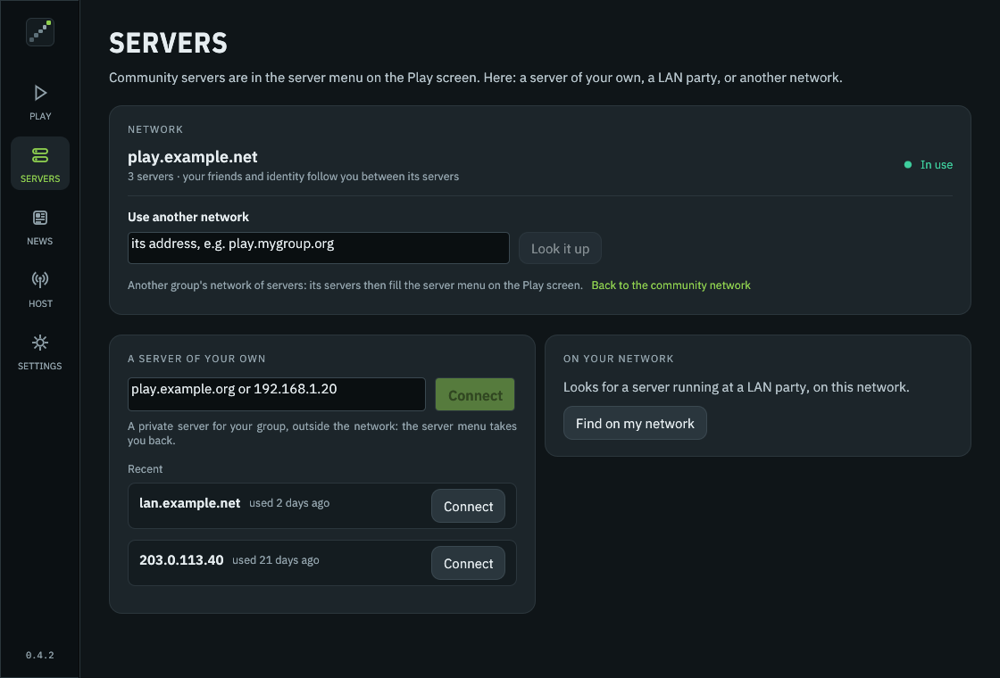

<p align="center">
  
</p>

<h1 align="center">5th Echelon Enhanced</h1>

<p align="center">
  <b>Community servers for <i>Tom Clancy's Splinter Cell: Blacklist</i> multiplayer, and a launcher that sets the game up for you.</b><br>
  Co-op and Spies vs Mercs, years after the official servers went dark.
</p>

<p align="center">
  <a href="#the-community-server"><b>Community server</b></a> ·
  <a href="#play-in-five-minutes">Play</a> ·
  <a href="#linux-and-steam-deck">Linux &amp; Steam Deck</a> ·
  <a href="#host-a-server">Host a server</a> ·
  <a href="#run-your-own-server">Run your own</a> ·
  <a href="#features">Features</a> ·
  <a href="#whats-new-since-5th-echelon">What's new</a> ·
  <a href="#contributing">Contribute</a> ·
  <a href="#community">Community</a>
</p>

---

## The community server

**There are public 5th Echelon servers that anyone can play on, for free.** Get the launcher and press Connect: it picks the server closest to you.

<table>
<tr><td><b>Address</b></td><td><code>play.scbl.jdevwebb.net</code>: the community network, the launcher's default; it pings every server in it and sets you up on the best</td></tr>
<tr><td><b>Servers</b></td><td>Europe: <code>eu1.scbl.jdevwebb.net</code> (Falkenstein, Germany)<br>North America: <code>na1.scbl.jdevwebb.net</code> (Beauharnois, Canada)<br>Oceania: <code>oceania.scbl.jdevwebb.net</code> (Australia)</td></tr>
<tr><td><b>Modes</b></td><td>Co-op and Spies vs Mercs: Find Teammate, Quick Match, lobby and private-match invites</td></tr>
<tr><td><b>Friends</b></td><td>Friends-only lists and invites, blocking, player search; your friends follow you to every server in the community network</td></tr>
<tr><td><b>Internet play</b></td><td>No VPN or port forwarding: the server tells your game its public address, and relays matches when a router can't be reached</td></tr>
<tr><td><b>Your account</b></td><td>No password to remember: your launcher's identity finds your account on every server, from any PC</td></tr>
<tr><td><b>Security</b></td><td>Sign-ins never travel unencrypted; each server gets its own random password; the launcher and the servers install only releases signed with the release key, and the servers update themselves</td></tr>
</table>

**To play:**
1. Download **`launcher.exe`** (Windows) or **`launcher-linux-x86_64`** (Linux, Steam Deck) from the [latest release](https://github.com/JDevWebb/5th-echelon-enhanced/releases/latest).
2. Run it. Under **Choose a server** it lists the community servers with your ping to each, the closest already picked.
3. Press **Connect** (the first time, pick the name other players will see), then **Play**. Press <kbd>F5</kbd> in the game to add friends.

The launcher pings every server in the network and sets you up on the one with the lowest ping (the setup log says which). Afterwards the Play screen lists them all with your ping to each, and **Switch** moves you to another in one click, with the same name and friends.

### Run your own server

The community network's servers are run by its maintainers. **Run your own** for your group, on any small Linux VPS, with one script:

```sh
curl -fsSLO https://raw.githubusercontent.com/JDevWebb/5th-echelon-enhanced/main/scripts/install-server.sh
sudo bash install-server.sh
```

Then choose how it fits in:

- **Start a network of your own.** Run your own coordinator: on the same machine as your server (choose "run a coordinator here too"), or on a machine of its own (`--coordinator-only`). Your community gets its own directory and its own friends, completely independent of the community network. Pass the join token to the servers you trust. You get the same automatic updates for your servers, and an admin UI of your own ([docs/operations.md](docs/operations.md)).
- **Or keep it to yourselves:** a server on its own, for a group of friends or a LAN.

The step-by-step guide, with DNS (Cloudflare included), firewalls, sizing and troubleshooting: **[docs/deploying.md](docs/deploying.md)**.

Tell us how it goes: bugs, ideas and questions are all welcome as [issues](https://github.com/JDevWebb/5th-echelon-enhanced/issues), and the [Discords below](#community) are the place to find players.

---

## Standing on the shoulders of

**5th Echelon Enhanced is developed by [JDevWebb](https://github.com/JDevWebb), building on [5th Echelon](https://github.com/unixoide/5th-echelon) by [unixoide](https://github.com/unixoide).** unixoide reverse-engineered the game's Quazal online stack, wrote the server, the launcher and the game hook, and documented the protocols in the [5th Echelon reference](https://unixoide.github.io/5th-echelon). None of 5th Echelon Enhanced would exist without that work. It began as a fork of 5th Echelon 0.2.5 and is now developed as a project of its own; upstream's history and its authors are kept in this repository.

### Authors and contributors

| | Contribution |
|---|---|
| **[unixoide](https://github.com/unixoide)** | Created 5th Echelon: the dedicated server, the Quazal/PRUDP/RMC implementation, the launcher, the game hook and the protocol research |
| **[Matthias Walther (MPW1412)](https://github.com/MPW1412)** | Invites into private matches, worked out in the game itself ([#123](https://github.com/unixoide/5th-echelon/pull/123)); the DLL version parser building on any OS ([#124](https://github.com/unixoide/5th-echelon/pull/124)); the Linux findings on CD keys and many-core CPUs ([#98](https://github.com/unixoide/5th-echelon/issues/98)) |
| **[Thiago (Thiagogob)](https://github.com/Thiagogob)** | Found why the game says "service not available" under Wine/Proton, and fixed it by emulating the network check Wine lacks ([#128](https://github.com/unixoide/5th-echelon/pull/128)); the reason Linux and Steam Deck work |
| **[Sergey P. (ThirteenAG)](https://github.com/ThirteenAG)** | Contributions to upstream 5th Echelon |
| **[koteykaby](https://github.com/koteykaby)** | Contributions to upstream 5th Echelon |
| **[Michał Kapała (michal-kapala)](https://github.com/michal-kapala)** | Contributions to upstream 5th Echelon, and co-author of [GROBackendWV](https://github.com/zeroKilo/GROBackendWV) |
| **[Askorbinovaya Kislota](https://github.com/askorbinovaya-kislota)** | Contributions to upstream 5th Echelon |
| **[zeroKilo](https://github.com/zeroKilo)** | [GROBackendWV](https://github.com/zeroKilo/GROBackendWV), which shares parts of the protocol and helped get 5th Echelon started |
| **[JDevWebb](https://github.com/JDevWebb)** | 5th Echelon Enhanced: the new launcher, automatic setup, internet play without a VPN, friends, identities and the coordinator, the network's automatic updates and admin UI, server hardening and the security audit, the community API, and the community network |

Every upstream commit keeps its original author in this repository's history, and merged pull requests keep their authors' commits. The [changelog](#whats-new-since-5th-echelon) lists what 5th Echelon Enhanced changed and where each change came from.

Also used: [IBM Plex](https://github.com/IBM/plex) Sans, Sans Condensed and Mono (SIL Open Font License) for the overlay and launcher, [egui](https://github.com/emilk/egui) for the launcher, and [hudhook](https://github.com/veeenu/hudhook) with [Dear ImGui](https://github.com/ocornut/imgui) for the overlay.

**Want your name here?** See [Contributing](#contributing). Fixes, testing reports, research and documentation all count.

### Become a collaborator

**Already authored commits to 5th Echelon,** here or upstream (code, pull requests, fixes)? You're welcome as a collaborator: [open an issue](https://github.com/JDevWebb/5th-echelon-enhanced/issues/new) asking to be added, and I'll add you.

**New to the project** but want to help run it (reviewing pull requests, triaging issues, testing releases)? Open an issue saying a little about yourself and what you'd like to help with.

---

## Play in five minutes

You need **Splinter Cell: Blacklist on PC** (Steam or Ubisoft Connect) and **Windows 10 or 11**. On Linux or a Steam Deck, see [Linux and Steam Deck](#linux-and-steam-deck).

1. **Download `launcher.exe`** from the [latest release](https://github.com/JDevWebb/5th-echelon-enhanced/releases/latest). It's one file; put it anywhere.
2. **Run it.** It finds the game on its own: Steam libraries, Ubisoft Connect, and the usual folders on every drive. If it can't, choose the folder with `Blacklist_game.exe`; it remembers it.
3. **Choose a server.** The launcher walks you through it:
   - it lists the [community network's](#the-community-server) servers with your ping to each and picks the closest; or type the address your own community gave you (for a network, it pings its servers and picks the closest), or press **Find on my network**;
   - press **Connect**. The launcher finds your account with your identity; if you don't have one there yet, it asks for the name other players will see and makes it.
4. **Press Play.**

**Used upstream 5th Echelon before?** Use this launcher instead of the old one; you don't need to uninstall anything first:
- **The client:** it replaces the old 5th Echelon DLL with its own, keeping the game's original file (`uplay_r1_loader.orig.dll`) as before.
- **Your saves** carry over: the same saves in `%APPDATA%\5th-Echelon\Saves`.
- **Your old settings are set aside, not used.** The old launcher's `uplay.toml` (its server, accounts, network adapter and switches) is kept as `uplay.toml.old` in the game folder, and the launcher starts from its own settings with the setup screen: choose a community server and press **Connect**. The launcher makes you an account there with your new identity; old usernames and passwords from other servers aren't needed. Kept: your game version (DirectX 9 or 11) and a save folder you chose.
- **Radmin VPN, Hamachi and the like** can stay installed, and don't need to be on: you don't need a VPN for the community servers.

<p align="center">
  
</p>
<p align="center">
  
</p>

**What Connect does for you:**
- installs the 5th Echelon client into the game, keeping the game's own file so you can undo it;
- checks the server answers;
- finds your account with your identity (no username or password to remember), or creates one with the name you choose, with a random password for that server only;
- keeps every account linked to your identity, so friends follow you between servers and a new PC signs straight in;
- leaves the network adapter to the game: each time it starts, it uses the one that reaches the server, so other players can reach you (and switching between Wi-Fi and Ethernet doesn't matter);
- brings over your Ubisoft Connect save, or makes a rank 5 one, so co-op and Spies vs Mercs are unlocked.

The **Status** card on the home screen keeps an eye on all of this. Anything that goes wrong later (a VPN that's off, an update) shows up there with a button that fixes it, and the bar beside **Play** says whether you're ready. **Friends** shows who's online and what they're playing (and friends on other servers, with a button to join them), and **Server news** turns through the server's news; the **News** screen has all of it. The **Servers** screen lists the network's servers with your ping, the players on each and the friends there, and switches you over in one click; your identity signs you in there with the same name.

**How did that go?** When the game closes after something went wrong (a join that failed, a crash, a refused sign-in), and about once a week after a normal online game, the launcher asks how it went: good or not, what went wrong, and a comment. If you agree, your logs go with it to the admins of the server you play on, who see them in the admin UI's Reports. Before anything leaves your PC, your user folder, your PC's and Windows account's names and your internet address are hidden, and **What's sent** shows exactly what goes. It asks at most once a day; **Don't ask again** (or **Settings › Feedback**) turns it off, and **Settings › Feedback › Send feedback** sends one any time.

<p align="center">
  
</p>

> [!TIP]
> **No VPN needed.** The server tells your game its public address, so friends anywhere can join your matches; when a router can't be reached directly, the match goes through the server instead. See [Playing over the internet](#playing-over-the-internet).
>
> **VPNs and the community servers:**
> - **Radmin VPN, Hamachi, ZeroTier, Tailscale** and other "virtual LAN" VPNs can stay installed: each time the game starts, it uses the adapter that actually reaches the server, so other players aren't given your VPN address. You don't need them for the community servers.
> - **A VPN that sends all your traffic through it** (NordVPN, ProtonVPN, Mullvad and the like) works, but adds delay, and your matches go through the server's relay. The Status card notes it (**Playing through NordVPN**, say) without stopping you playing; turn it off while you play if you can, then press **Check again**.
> - **Your group's own server inside a VPN** (a Radmin network address, say)? Turn the VPN on before starting the game: the game then plays over the VPN's adapter, as that's what reaches the server. To be sure it never uses another network, pin the VPN's adapter in **Settings › Network adapter** and tick **Don't start the game without this adapter**.

### Playing over the internet

Matches run peer to peer: your game talks straight to the other players' games. By itself, the game only knows its local address (`192.168.x.x`), so upstream needed everyone on one LAN or VPN. Now:

1. When a match starts, the client asks the server's **NAT helper** for your public address, from the game's own match port, and tells the game to advertise that address instead. The game's own NAT probing then gets through most home routers.
2. The client also asks your router to **forward the match port** (UDP 13000) while the game runs, with UPnP or NAT-PMP, when the router allows it.
3. When neither works (mobile hotspots, some ISPs' carrier-grade NAT, strict routers), the match goes **through the server's relay**. It adds a little delay; the rest of the match is unchanged.

**Settings › Network › Internet play** chooses how: **Automatic** (the default), **Always through the server**, or **LAN or VPN only** (the game's own behaviour). The overlay's **Server** pane shows which one you got. The server needs UDP 21128–21129 open; see [Host a server](#host-a-server).

### In the game

Press <kbd>F5</kbd> for the overlay:
- **Friends:**
  - your friends and what they're playing, with invite buttons;
  - friend requests to answer, and who you've blocked.
- **Find players:** search by name or see who's online, then add a friend, block someone or invite them.
- **Invites:** accept one and you go straight into that match.
- **Match:** change the lobby's minimum and maximum players. For example, co-op with more than two, or Spies vs Mercs with fewer than four.
- **Server:** which server you're on, how other players reach you (directly, through a router port, or through the server's relay), and **Sign in again**.

Invites and friend requests also pop up as notifications. Friend lists, blocking and sharing friends between servers are in **[docs/friends.md](docs/friends.md)**.

### When something doesn't work

1. **Look at the Status card** on the home screen and press the button under anything red.
2. **Run Settings › Network › Connection test.** It checks each part in turn:
   - the server's config (port 80) and its API;
   - signing in to the game service (21126);
   - how other players reach your PC, in the words the overlay uses in game: **Direct**, **Direct, router port opened** (it asks your router to forward the match port with UPnP or NAT-PMP, as the game does, then removes it), or **Through the server's relay** when no port can be opened. Only a port that's open but still unreachable (a firewall on the PC, or a second router) is a warning: set Internet play to **Always through the server** then;
   - the server's internet play helper (21128).
3. **The game's log** is `bl-tracing.log` in the game folder; the previous game's is `bl-tracing.prev.log`. Include it when you ask for help.

<p align="center">
  
</p>

### Antivirus warnings

Some antivirus programs, Microsoft Defender included, may flag `launcher.exe` or `uplay_r1_loader.dll`, with names like `Trojan:Win32/Wacatac.H!ml` or `Behaviour:Win32/DefenceEvasion.A!ml`. **These are false positives.**
- **Why it happens:** the launcher installs a DLL into the game, and that DLL hooks the game to talk to community servers instead of Ubisoft's. Cheats and malware do the same kinds of things. The files are also new and not yet code-signed.
- **What the names mean:** a name ending in `!ml` is a machine-learning guess, and one starting with `Behaviour:` is a judgement on what the program did. Neither matched known malware. [VirusTotal](https://www.virustotal.com) scans of every release are linked in its release notes.

**Check your download is genuine** before trusting it:
1. Get it only from this repository's [releases](https://github.com/JDevWebb/5th-echelon-enhanced/releases).
2. Compare its checksum with the release's `SHA256SUMS`. In PowerShell: `Get-FileHash .\launcher.exe`.
3. Optionally, check it was built by this repository's release workflow: `gh attestation verify launcher.exe --repo JDevWebb/5th-echelon-enhanced`.

**If your antivirus quarantined it:**
1. **Restore it:** Windows Security › Virus & threat protection › **Protection history**. Open the detection, then **Actions › Restore** (or **Allow on device**).
2. **Exclude just these two folders**, so it isn't removed again: the folder with `launcher.exe`, and the game's `src\SYSTEM` folder (where `uplay_r1_loader.dll` lives). Use Windows Security › Virus & threat protection › Manage settings › **Exclusions**, or an administrator PowerShell:
   ```powershell
   Add-MpPreference -ExclusionPath "C:\Games\5th-Echelon"
   Add-MpPreference -ExclusionPath "C:\Program Files (x86)\Steam\steamapps\common\Splinter Cell Blacklist\src\SYSTEM"
   ```
   Use your own paths. **Settings › Client** in the launcher shows the game folder.
3. **Press Connect again** if the DLL was removed; it reinstalls it.
4. **Report the false positive** to your antivirus: [Microsoft](https://www.microsoft.com/wdsi/filesubmission), [Avast/AVG](https://www.avast.com/false-positive-file-form.php), [Bitdefender](https://www.bitdefender.com/submit/), [Kaspersky](https://opentip.kaspersky.com/), [ESET](https://support.eset.com/en/kb141), [Norton](https://submit.norton.com/). Reports clear the detection for everyone, usually within days.

Don't turn your antivirus off; the two exclusions are all it needs. We report every release to Microsoft, and are working on code-signing the Windows files, which stops most of these warnings.

---

## Linux and Steam Deck

The game runs under Proton (Steam) or Wine (Lutris, Heroic, …), and 5th Echelon works there too. The client detects Wine and fixes what Wine leaves out:
- the network check behind "The Splinter Cell Blacklist service is not available";
- starting without Ubisoft Connect.

### With the Linux launcher (recommended)

1. **Download `launcher-linux-x86_64`** from the [latest release](https://github.com/JDevWebb/5th-echelon-enhanced/releases/latest) and make it executable:
   ```sh
   chmod +x launcher-linux-x86_64 && ./launcher-linux-x86_64
   ```
   On a Steam Deck, do this in **Desktop Mode**.
2. **If you've never started the game on this PC, start it once from Steam and quit.** Proton only creates the game's Wine files on its first run, and your save goes in there; the launcher's Status card reminds you.
3. **Join a server and press Connect**, as on Windows. The launcher finds the game in any Steam library (native, Flatpak or Snap, SD card included), or in Lutris, Heroic and `~/.wine` prefixes. You can also choose the folder yourself.
4. **Press Play.**
   - Steam games start through Steam, with Proton.
   - Other installs start with `wine` in their own prefix, or from the app you installed them with.

**On a Steam Deck,** you only need Desktop Mode for the setup. The client is installed in the game's own folder, so afterwards just play from your library in **Game Mode**.

> [!IMPORTANT]
> **CPUs with more than 16 threads:** under Wine the game can freeze at start, with or without 5th Echelon. The launcher's Status card and Settings show the fix: a Steam launch option (Properties › Launch options), with a Copy button:
> ```
> WINE_CPU_TOPOLOGY=16:0,1,2,3,4,5,6,7,8,9,10,11,12,13,14,15 %command%
> ```
> The launcher sets it by itself when it starts the game with Wine.

### With `launcher.exe` inside Proton

The Windows launcher also runs under Proton:
1. Add it to Steam as a non-Steam game, next to the game.
2. Make it use **the game's own prefix**, so settings and saves end up where the game looks. Set its launch options to:
   ```
   STEAM_COMPAT_DATA_PATH="<your Steam library>/steamapps/compatdata/235600" %command%
   ```

It then starts the game directly, CPU fix included. (This route hasn't been tested as much as the Linux launcher; reports are welcome.)

### Without a launcher

Everything the launcher does can be done by hand:
1. Put `uplay_r1_loader.dll` from a release in the game's `src/SYSTEM` folder, after renaming the game's own to `uplay_r1_loader.orig.dll`.
2. Write `uplay.toml` there, or `uplay.override.toml` (see [below](#setting-up-the-game-from-another-tool)), with the server and your account.

---

## Features

### For players
- **Online co-op and Spies vs Mercs:**
  - matchmaking through Find Teammate and Quick Match;
  - lobby invites;
  - **invites into private matches**.
- **Internet play without a VPN:** public addresses from the server, router port forwarding (UPnP / NAT-PMP), and a relay through the server when a router can't be reached.
- **An automatic setup:** game detection, client install, your account found (or made) with your identity, the network adapter chosen at every start, and your save (your Ubisoft Connect one, or a new rank 5 one), then a Status card with a fix for each problem.
- **An in-game overlay** (<kbd>F5</kbd>): friends and what they're playing, friend requests, player search and blocking, invites, lobby player limits, and server status.
- **One identity, every server:** the launcher makes you an identity (a key that stays on your PC) and links every account to it. It finds your account on a server by itself, with no username or password to remember, and asks for a name only the first time. Friends made on one server show up on every other server that shares a coordinator, and friends playing on another of them are listed in the overlay and the launcher, which joins you to their server in one click. Moving PCs? Copy your identity across in **Settings**, before connecting on the new PC ([how](docs/friends.md#your-identity)).
- **Your name is yours:** servers that share a coordinator reserve each name for one player. Elsewhere, the overlay warns when someone has a friend's name but isn't them. You can rename your account from the launcher.
- **A server directory:** joining a server that shares a coordinator brings in its directory. The launcher pings every server in it, preselects the best (the lowest ping, then the busiest), and offers a one-click **Switch** to a closer one.
- **Save games:**
  - a rank 5 save for new players with no save anywhere;
  - raising an existing save to rank 5 (with a backup first);
  - your Ubisoft Connect save brought over at setup (the newest, from any Ubisoft account on the PC, on Windows and in a Proton or Wine prefix), and raised to rank 5 only if it's lower;
  - importing any save file: from another PC, Ubisoft Connect's `1.save`, or one of the launcher's backups;
  - backups.
- **Staying signed in:**
  - the client signs in again on its own if the server restarts or your sign-in lapses;
  - logins survive server restarts.
- **Updates:** the launcher updates itself from this project's releases (each one's notes carry checksums, build provenance and [VirusTotal](#antivirus-warnings) results). It checks every download against the published SHA-256 checksums, and the checksums against the release key's signature, so a changed release is never installed.
  - **When:** at start, every 4 hours while it's open, and at once when a server refuses it as outdated (the Status card then offers **Update**). Development builds never update themselves.
  - **One release:** the launcher and the client DLL it installs are always the same version; the launcher replaces any other version in the game folder. Servers refuse launchers and clients older than they allow (by default, their own release).
- **Your details stay yours:**
  - the launcher and overlay use HTTPS where the server offers it, so passwords and sign-ins never travel unencrypted;
  - a network's admin UI sees counts and cities, never your name or address; your launcher reports its ping to each server in a directory, from which only your city is noted;
  - a server directory is used only over `https://`, never replaces one you chose, and lists only public hosts, each shown by name;
  - on Windows, saved passwords and your identity key are encrypted for your Windows user.
- **Fits your screen:** resize, maximise or go full screen (<kbd>F11</kbd>) and the launcher scales to fit; on a small or high-DPI screen it starts smaller. Make everything bigger or smaller in **Settings › Display** or with <kbd>Ctrl</kbd> + / <kbd>Ctrl</kbd> −.
- **Linux and Steam Deck:** a native Linux launcher, Proton and Wine support in the client, and the many-core CPU fix.
- **Unusual game builds:** unknown game executables can be identified from the launcher, which covers most mods.

### For server operators
- **One server for everything:** accounts, matchmaking, invites, friends and presence, news, challenges, and the game's configuration and content.
- **Friend lists for public servers:** friends-only lists and invites (`[friends] mode = "mutual"`), blocking, and rate limits on invites and friend requests.
- **Friends across servers:** a **coordinator** shares friendships and blocks between servers, reserves each player's name across them, and lists them in a server directory. The Linux installer runs one next to your server, or on a machine of its own, for [a network of your own](#run-your-own-server).
- **A network that updates itself:** the coordinator rolls out each signed release to its servers, one first, then the rest. Each server's updater checks the signature, and puts the previous release back if the new one doesn't come back healthy. Members keep up, or leave the directory.
- **An admin UI for the network:**
  - **What it shows:**
    - players and where they are (cities, on a map);
    - what's being played;
    - pings from players and the coordinator;
    - each server's CPU, memory and bandwidth, live;
    - bandwidth over time: in, out and relayed, the 95th percentile, monthly allowances, CSV export;
    - players over time, play time and when people play, and the matches played (by mode, map, length and players);
    - the players on every server, by name, with their play time, sessions and matches, and actions on them: kick, ban, a new password, rename, delete (never their addresses);
    - alerts (a server offline, CPU, memory, disk, refused sign-ins, the traffic allowance, failed updates), optionally posted to Discord or Slack;
    - players' reports after their sessions (what went wrong, their logs, redacted on their PC, and the server's), to read and resolve, each posted to the alert chat;
    - the update rollout.
  - **How it's protected:**
    - it's served only through Cloudflare;
    - sign-in takes passkeys, or a password with an authenticator app;
    - sign-in can be limited by address and country;
    - every action is recorded in an audit log.
  - See [docs/operations.md](docs/operations.md).
- **A one-script Linux install:** Caddy with automatic certificates, the API over HTTPS, sandboxed systemd services (Caddy included, its admin API on a root-only socket), firewall rules, a guided setup for sharing friends, `--status`, and updates that check the release's signature. See [docs/deploying.md](docs/deploying.md).
- **A hardened host in one more script:** `scripts/harden-host.sh` does the following:
  - installs updates, and lets unattended upgrades reboot at a quiet hour;
  - locks SSH down to keys, named users and local tunnels, optionally on another port, with an automatic undo if you'd be locked out;
  - adds fail2ban;
  - hardens the kernel and turns off services a server doesn't need.
- **Runs anywhere:**
  - Windows, from the launcher's **Host** screen or on its own;
  - Linux;
  - Docker.
- **A management screen** in the launcher: see and remove players and games, and read the log. It works for the server on your PC, or for a remote server through an SSH tunnel with its admin key.
- **Built for the public internet**, and [audited](#whats-new-since-5th-echelon):
  - rate limits on logins (per address and per account), new accounts, invites, searches and friend requests;
  - login tickets that expire, and API tokens that end when the password changes;
  - private matches need an invite, are never offered to Find Teammate or Quick Match, and only a match's own players can change them;
  - caps on packets, fragments, connections per address, sessions and lookups;
  - the admin API never reachable from the internet;
  - a malformed packet can't crash it.
- **Internet play for everyone:** a NAT helper tells each game its public address, and relays matches for players whose routers can't be reached directly.
- **Fixes joins over VPNs:** `trusted_subnet` corrects players who advertise the wrong network adapter.
- **A community API** on port 80, each part opt-in: server info, who's online, and sign-up for tools (off where accounts need an identity).

---

## Host a server

Players need to reach these ports on the server:

| Port | Protocol | What |
|---|---|---|
| 80 | TCP | The game's online configuration, and the community API. **The game always uses port 80.** |
| 443 | TCP | The launcher's API over HTTPS, and a coordinator (with the Linux installer's Caddy) |
| 8000 | TCP | Content (multiplayer balancing) |
| 21126 | UDP | Game login |
| 21127 | UDP | Game service |
| 21128–21129 | UDP | Internet play: players' public addresses, and the relay |
| 50051 | TCP | Accounts, friends and invites (the launcher and overlay); behind Caddy it's served on 80 and 443 instead |

Matches run **peer to peer** between players. The server's NAT helper (21128–21129) lets them reach each other over the internet, and relays matches for players whose routers can't be reached directly. Relayed matches use roughly 20–60 KB/s per player on the server; see [`[nat]`](docs/server-settings.md#nat-internet-play-without-a-vpn) to limit or switch it off.

**The public address** is the one thing every server needs set: the address players connect to. Without it, the server tells players to connect to `127.0.0.1`. Use:
- your **public IP**, with the ports above forwarded to the server;
- or the server's **VPN address**, if everyone plays over one VPN.

### On Windows: from the launcher (easiest)

1. Open the launcher's **Host** screen. If `dedicated_server.exe` isn't next to the launcher, press **Download the server**.
2. Choose what to **listen on** (every address is fine), and fill in the **public address** if players come in through port forwarding.
3. Switch on the community API parts you want, then press **Start server**.

The launcher stops the server when it closes. The **Manage a server** section lists players and games, and shows the log.

<p align="center">
  
</p>

### On Windows: on its own

For a server that keeps running without the launcher (e.g. as a scheduled task or service):

1. Put `dedicated_server.exe` from the [release](https://github.com/JDevWebb/5th-echelon-enhanced/releases/latest) in its own folder, e.g. `C:\5th-echelon`.
2. Allow the ports through Windows Firewall, from an administrator PowerShell:
   ```powershell
   New-NetFirewallRule -DisplayName "5th Echelon (TCP)" -Direction Inbound -Protocol TCP -LocalPort 80,8000,50051 -Action Allow
   New-NetFirewallRule -DisplayName "5th Echelon (UDP)" -Direction Inbound -Protocol UDP -LocalPort 21126-21129 -Action Allow
   ```
3. Start it from that folder with the address players connect to:
   ```powershell
   cd C:\5th-echelon
   .\dedicated_server.exe --public-address 203.0.113.10
   ```

The first start writes `service.toml` (the settings) and creates the database, keys and `data\` folder next to it.

### On Linux

**The quick way:** one script installs the server as a systemd service on a fresh VPS. It detects Debian, Ubuntu, Fedora, Rocky/Alma or Arch, and can put Caddy in front on a domain name. The full guide is **[docs/deploying.md](docs/deploying.md)**.

```sh
curl -fsSLO https://raw.githubusercontent.com/JDevWebb/5th-echelon-enhanced/main/scripts/install-server.sh
sudo bash install-server.sh
```

- **It asks for a domain name**, e.g. `blacklist.example.com`, with an A record pointing at the server (on Cloudflare: DNS only, not proxied). With one, Caddy serves the game's web parts on port 80 and the launcher's API over HTTPS on 443, so only TCP 80 and 443 and UDP 21126–21129 need to be open. Leave it empty to skip Caddy.
- **It asks whether to share friends:** keep the server on its own, run a coordinator here too, or join a coordinator your group runs elsewhere.
- **It then:**
  - downloads the latest release, and checks its checksum and the release key's signature;
  - creates a system user and a sandboxed service;
  - gets certificates, and switches the launcher's API to HTTPS once they work;
  - opens the ports in ufw or firewalld, if either is active;
  - lists the ports to open on your provider's firewall.
- **Friend lists are friends-only** on a new install (`--friends mutual`) unless you choose `--friends everyone`.
- **Without questions:** `--domain`, `--coordinator-domain` (run a coordinator here), `--coordinator` and `--join-token-file` (join one), `--coordinator-only` (a coordinator and no game server), `--server-name`, `--region`, `--alias`, `--admin`, `--closed-registration`, `--unlisted` and `--yes`.
- **Looking after it:** `--status` shows what's running, whether it has joined its coordinator, and the updater's last result; `--show-join-token` and `--rotate-join-token` manage a coordinator's token.
- **Updates:** in a network, the server installs the coordinator's signed releases by itself (`--no-auto-update` turns that off, and a network then delists it). Every account needs a player identity on a new install (`[limits] require_identity`).
- **The machine:** `scripts/harden-host.sh` hardens the rest of the host. See [Hardening the machine](docs/deploying.md#hardening-the-machine).
- **The admin UI:** `--metrics-domain` (with a Cloudflare Origin CA certificate: `--metrics-cert`, `--metrics-key`) turns on a coordinator's admin UI, served only through Cloudflare. `--add-admin` invites an admin, and `--reset-admin` gives one a new setup link. See [docs/operations.md](docs/operations.md).
- **Running it again updates the server**, keeping accounts and settings (anything not given again stays as it was). `--uninstall` removes it and the firewall rules it added, and `--help` lists the rest.

**By hand:**

1. Download `dedicated_server-linux-x86_64` from the [release](https://github.com/JDevWebb/5th-echelon-enhanced/releases/latest), or [build it](#build-from-source).
2. Give it a folder and a user of its own:
   ```sh
   sudo useradd --system --home /srv/5th-echelon --create-home 5th-echelon
   sudo install -m 755 dedicated_server-linux-x86_64 /srv/5th-echelon/dedicated_server
   ```
3. Port 80 is privileged. Let the server bind it without running as root:
   ```sh
   sudo setcap cap_net_bind_service=+ep /srv/5th-echelon/dedicated_server
   ```
4. Run it under systemd, as `/etc/systemd/system/5th-echelon.service`:
   ```ini
   [Unit]
   Description=5th Echelon server
   After=network-online.target
   Wants=network-online.target

   [Service]
   User=5th-echelon
   WorkingDirectory=/srv/5th-echelon
   Environment=FE_PUBLIC_ADDRESS=203.0.113.10
   ExecStart=/srv/5th-echelon/dedicated_server
   Restart=always

   [Install]
   WantedBy=multi-user.target
   ```
   ```sh
   sudo systemctl enable --now 5th-echelon
   journalctl -u 5th-echelon -f
   ```
5. Open the ports in your firewall, e.g. with ufw:
   ```sh
   sudo ufw allow 80,8000,50051/tcp && sudo ufw allow 21126:21129/udp
   ```

The server exits if one of its services stops, so systemd's `Restart=always` brings it straight back.

### With Docker

Every signed release publishes the server's image to GitHub's container registry (`:latest`, or a release's version; `-unsigned` tags are builds nobody has signed off yet):

```sh
docker run -d --name 5th-echelon --restart unless-stopped \
  -e FE_PUBLIC_ADDRESS=203.0.113.10 \
  -p 80:80 -p 8000:8000 -p 21126-21129:21126-21129/udp -p 50051:50051 \
  -v 5th-echelon:/srv/5th-echelon \
  ghcr.io/jdevwebb/5th-echelon-server:latest
```

Or build it yourself with Compose, from a clone of this repository:

```sh
FE_PUBLIC_ADDRESS=203.0.113.10 docker compose -f docker/compose.yaml up -d
docker compose -f docker/compose.yaml logs -f
```

- It builds the server from source, publishes the ports above, and keeps everything it writes in the `data` volume: the database, keys, `service.toml` and `data/`. Nothing is lost when the container is rebuilt.
- The image has a health check on the API port, and the server runs as a user of its own with only the right to bind port 80. The compose file also makes the image read-only and drops every other privilege.
- The NAT helper needs to see players' real addresses. Docker on Linux keeps them; **Docker Desktop** (Windows, macOS) replaces them with its own, so run the server directly there, or use host networking.
- `FE_LISTEN` (default: every address) chooses the address to listen on.

To edit the settings, change `service.toml` in the volume and restart:

```sh
docker compose -f docker/compose.yaml exec server sh -c 'cat service.toml'
docker compose -f docker/compose.yaml restart
```

### Behind a reverse proxy

Running other services on the same machine? Everything TCP (the game's config on port 80, content and the API) can share port 80 with your other sites through **Caddy**, by host name. The UDP ports move to any free numbers. Set `[public]` in `service.toml` to what players connect to. The launcher reads it from the server, so players still only type the host name.

The guide, with a tested Caddyfile: **[docs/reverse-proxy.md](docs/reverse-proxy.md)**.

### Settings

The server reads `service.toml` from its working folder, writing the defaults on the first start. The settings 5th Echelon Enhanced adds are in **[docs/server-settings.md](docs/server-settings.md)**:

- **`[community_api]`:** server info, who's online, sign-up for tools, unhandled calls. Only server info is on by default.
- **`trusted_subnet`:** fixes joins when players' games advertise the wrong network adapter (e.g. everyone on one VPN).
- **`[limits]`:** failed logins and new accounts per address, whether new accounts are allowed, and whether every account needs a player identity (`require_identity`).
- **`[admin]`:** the admin API for the launcher's **Manage a server**. Its key is written to `admin-key.txt`.
- **`[nat]`:** internet play: the NAT helper's port, and who is relayed (`auto`, `all` or `off`) and how fast.
- **`[public]`:** the host name and ports players connect to, when they differ from what the server listens on (a reverse proxy, remapped ports), and which proxies' `X-Forwarded-For` to trust.
- **`[friends]`:** every player on the friend list (`everyone`, the default) or only friends (`mutual`).
- **`[clients]`:** the oldest launcher and client allowed to sign in (default: this server's own release; `"off"` for any).
- **`[federation]`:** a coordinator to share friends with other servers, this server's name and region in its directory, and whether it installs the network's releases (`auto_update`).

Command-line options: `--public-address <ip>`, `--listen <ip>`, and `-c <file>` for another settings file. The first two are also the `FE_PUBLIC_ADDRESS` and `FE_LISTEN` environment variables. The address options rewrite `service.toml` on every start, so the addresses always match.

---

<a id="whats-new-in-this-fork"></a>

## What's new since 5th Echelon

Compared with upstream [5th Echelon 0.2.5](https://github.com/unixoide/5th-echelon/releases/tag/v0.2.5):

**Launcher**
- Rewritten in egui around a new `setup` library, for Windows and Linux (Steam, Flatpak, Steam Deck, Lutris, Heroic).
- A guided first-run setup, and a Status card with fixes. **Connect** finds your account with your identity, and asks for a name only when you have none on that server.
- Typing a network's address (a coordinator) sets you up on its best server by ping; **Switch** moves to another.
- Adapter pinning that works (upstream's saved a value that never matched an adapter).
- Server management, and verified updates from this project's releases.
- Settings are never silently reset: an unreadable file is kept as `uplay.toml.broken`, and outside changes are merged rather than overwritten.
- No sample accounts; DirectX 11 by default.
- A window you can resize, maximise or make full screen (F11), with everything scaled to fit it, and your own size on top (Settings › Display, or Ctrl + / Ctrl −).

**Internet play**
- Players no longer need a LAN or VPN:
  - the client answers the game's own "what's my public address?" request with the address the server's NAT helper sees, so the game advertises it and punches through NAT itself;
  - it asks the router to forward the match port (UPnP, then NAT-PMP);
  - the server relays matches for players whose router can't forward a port to the game (no UPnP, carrier-grade or symmetric NAT);
  - the server corrects the address a game registers, if the game didn't take the public one.
- The findings behind it are in [docs/research/nat-traversal.md](docs/research/nat-traversal.md).

**Friends**
- Real friend lists instead of "everyone on the server":
  - requests, blocking and player search in the overlay;
  - friends-only lists and invites for public servers.
- An identity per player that links their accounts across servers, and signs them in on a new PC.
- A coordinator that shares friends between servers, reserves names across them, and keeps a server directory; the launcher adopts it on joining a server that names it over HTTPS, pings every server and preselects the best.
- Every account is linked to its player's identity: the launcher finds your account on a server by itself, and asks for a name only when you have none there yet. Servers can require it (`[limits] require_identity`, on by default with the installer).
- Renaming, with the account id kept, and warnings in the overlay about players using a friend's name on another server.
- Each server gets its own random password (upstream reused one everywhere); on Windows it's saved encrypted.
- See [docs/friends.md](docs/friends.md).

**Running a network**
- **Automatic updates:**
  - the coordinator rolls out each release signed with the release key to its servers: one first, watched for 10 minutes, then the rest when they're quiet;
  - each machine's root updater checks the signature again, keeps the previous binaries, and puts them back if the new release doesn't come back healthy;
  - admins can pause, pin, halt or roll back.
- **Membership is kept current:** servers that don't install updates, or still run an old release a day after a rollout, leave the directory.
- **Metrics from every server:** players, cities (DB-IP, looked up on the server; no addresses sent), what's being played, sign-ins, load, bandwidth and relayed traffic. Pings come from the coordinator and from players' launchers.
- **An admin UI:**
  - the views: overview, servers, bandwidth, players and map, playlists, network, alerts, players' reports, updates, security and audit log, updated live;
  - sign-in: passkeys, an authenticator app or recovery codes;
  - address and country restrictions;
  - served only through Cloudflare.
- See [docs/operations.md](docs/operations.md).

**Security**
- A security audit of the server, the client, the launcher, the coordinator and the installer, and every finding fixed:
  - **client:** the strings and friend data a server sends can no longer overflow the game's memory; the friend list no longer blocks or leaks; a server can't join you to a match without your click (`AllowForceJoin`, off);
  - **game protocol:** decompression, fragment and connection caps; replies go only to a connection's own address; the login proof is checked before anything else; private matches need an invite; the game's own invites follow friends-only mode and blocks;
  - **accounts and API:** login limits per account and per IPv6 /64, tokens that end when the password changes, the same answer for unknown users and wrong passwords, blocks that stay invisible, activity shown to friends only, reserved names;
  - **identity:** signatures name the server you actually connected to, and a key login signs the password it sets, so a malicious server can't replay them elsewhere;
  - **NAT helper:** registrations need a ticket from your login, replies carry a cookie, relayed packets a tag, with caps per address and a packet rate limit;
  - **coordinator:** a server can't take over another's place, typed and checked listings, rate limits, `remove-server` and `new-token`.
- **The launcher's API over HTTPS** where the server has a domain; the admin API is never reachable from the internet, and the launcher warns before sending an admin key unencrypted.
- **Signed releases:** the launcher and the installer install only releases whose checksums carry the release key's signature; downloads are size-capped; CI pins its actions and attests every download's provenance.
- **Installer and Docker:** inputs checked, the join token never printed, sandboxed services (Caddy too, with its admin API off the network), Caddy from its own package repository or a static build pinned by checksum (updated on reruns), the server image without root.
- **The admin UI:**
  - passwords with Argon2id;
  - TOTP and passkeys (WebAuthn, with user verification);
  - single-use recovery codes, and lockouts after failed sign-ins;
  - a fresh second factor for sensitive changes;
  - CSP, CSRF and origin checks;
  - an audit log.
- **Hosts:** `harden-host.sh`, for SSH, fail2ban, the kernel, and automatic updates (Caddy's included) with reboots at a quiet hour.

**Invites and matches**
- Invites into private matches, from [#123](https://github.com/unixoide/5th-echelon/pull/123) by Matthias Walther, with follow-up fixes:
  - pushes are resent until acknowledged;
  - duplicate packets are answered, not handled twice.
- Leaving and abandoning a session removes the player, and empty sessions end.
- Private matches (co-op and Spies vs Mercs) stay out of matchmaking: a room with only private seats counts as invite-only, whatever the game announces, so Find Teammate no longer drops a stranger into someone's private co-op match.
- Co-op loads over the relay: it carries the game's largest packets (up to 1,472 bytes), which co-op sends while a mission loads.
- The `trusted_subnet` address fix for VPN play.

**Server stability and security**
- Crashes fixed:
  - bad packets can no longer take the server down;
  - a failed service restarts the process instead of leaving it half-alive;
  - matchmaking no longer panics on odd data.
- Logins survive restarts (the token keys are kept).
- Plain logins can no longer sign in as someone else; sample accounts are disabled (including the third one upstream left with its sample password).
- Names are unique whatever their case, the server sets account ids, API tokens expire after 30 days, and deleting an account with a pending invite works.
- Presence works; memory no longer grows without bound; the HTTP servers handle connections in parallel, with timeouts.
- Rate limits, expiring tickets, session owner checks, and a constant-time admin key check.
- An opt-in admin API setting, and gRPC reflection off by default.

**Game client**
- Works under Wine and Proton:
  - the network check Wine lacks is emulated ([#128](https://github.com/unixoide/5th-echelon/pull/128) by Thiago);
  - it starts without Ubisoft Connect there;
  - its network runtime uses two threads instead of one per CPU core.
- Signs in again on its own when the server says it's signed out.
- Players with the game in another language can join each other: the game refuses them as a "data version mismatch" although its code is the same, so the client turns that check off in the game it loads (`AllowDataMismatch = false` in `uplay.toml` restores it).
- Crash fixes in the hook.
- `uplay.override.toml`, for tools that set up the game (see below).
- A redesigned overlay.

**Tooling**
- Docker builds for Linux and Windows (`build/build.sh`), and a Docker image for the server.
- A Linux installer for servers and coordinators (`scripts/install-server.sh`), a host hardening script (`scripts/harden-host.sh`), a [deployment guide](docs/deploying.md) and an [operations guide](docs/operations.md).
- Load tests (`build/build.sh load`, [results](docs/load-testing.md)): 1,000 players on two cores.
- Headless test players (`tools/testbot`) that play through logins, lobby and private-match invites, internet play and the relay, friends, blocks, identities and renames, and packet loss against a real server; `proxy-test` runs them behind Caddy, and `federation-test` runs two servers sharing friends through a coordinator, and checks their metrics reach it.

### Setting up the game from another tool

Tools that set up the game (an installer, a VPN client, a community's own app) can write `uplay.override.toml` next to `uplay.toml`. It sets:
- the server (`ConfigServer`, `ApiServer`);
- the account (`[User]`);
- the network pin (`[Networking]`);
- optionally `[Managed] By = "Tool name"` and `HelpText`.

The hook applies it on every start, even if the launcher has never run. With `[Managed]` set, the launcher shows the install as managed by that tool and doesn't change its settings.

---

## Build from source

The simplest way needs only Docker, on Windows, macOS or Linux:

```sh
build/build.sh test       # workspace tests
build/build.sh bots       # test players against a fresh local server
build/build.sh proxy-test # the test players against a server behind Caddy
build/build.sh federation-test   # two servers sharing friends through a coordinator
build/build.sh load --players 500 --relayed 20   # a load test (see docs/load-testing.md)
build/build.sh server     # dist/dedicated_server-linux-x86_64, coordinator-linux-x86_64
build/build.sh windows    # dist/launcher.exe (client DLL inside), uplay_r1_loader.dll, dedicated_server.exe
build/build.sh linux      # dist/launcher-linux-x86_64 (client DLL inside: run windows first), dedicated_server-linux-x86_64, coordinator-linux-x86_64
build/build.sh sums       # dist/SHA256SUMS, for a release
build/build.sh ui         # the coordinator's admin UI (coordinator/admin-ui/dist)
```

The launcher and the client DLL are one release: a launcher build fails if the DLL it would carry is from another one (an old `dist/uplay_r1_loader.dll`, say), so build `windows` before `linux`.

`build/build.sh ui` builds the coordinator's admin UI (Vue 3 and Vite, in `coordinator/admin-ui`), which the coordinator embeds; the targets that build the coordinator run it first.

To build natively instead, install [rustup](https://rustup.rs) (the toolchain in `rust-toolchain.toml` installs itself) and the [Protobuf compiler](https://github.com/protocolbuffers/protobuf/releases/latest) (`protoc` on your `PATH`, or `PROTOC` pointing at it). The coordinator also wants [Node.js](https://nodejs.org) 18 or later, to build its admin UI first (`npm ci && npm run build` in `coordinator/admin-ui`); without it, the coordinator builds with a page saying so in place of the UI. Then:

```sh
cargo build --release -p dedicated_server                      # the server, for your OS
cargo build --release -p launcher --features embed-dll         # on Windows: builds the client DLL and embeds it
```

### Releases and CI

GitHub Actions tests and builds every push and pull request (Linux tests, the test players, and the Windows and Linux builds). Releases are published by pushing a version tag:

`release.toml`'s `version` is the one release number for the launcher, the client DLL, the server and the coordinator. Between releases it names the next one, with a `-dev` suffix on builds that aren't a release (`0.4.1-dev` until 0.4.1 is out); it moves on per release, not per change.

On the machine with the release key, one command does it all:
```sh
scripts/release.sh 0.4.1
```
It checks `main` is clean and that CI passed on it, drops the suffix in `release.toml`, commits and tags `v0.4.1`, pushes `main` and that tag, waits for the release workflow, runs `sign-release.sh` (which asks once before signing), publishes, and moves `main` on to `0.4.2-dev`. Release notes go in `docs/releases/v0.4.1.md`; the workflow puts them first.

By hand, the same steps are:
1. Drop the suffix in `release.toml` (e.g. `0.4.1`) and commit it.
2. Tag it with exactly that version, and push that tag by name (never `--tags`):
   ```sh
   git tag v0.4.1 && git push origin main v0.4.1
   ```
3. Sign and publish it:
   ```sh
   scripts/sign-release.sh v0.4.1
   ```

The release workflow:
- builds every download on Windows and Linux runners;
- writes `SHA256SUMS`, which the launcher's updater and the Linux installer check against;
- attests each download's build provenance (`gh attestation verify <file> --repo JDevWebb/5th-echelon-enhanced`);
- makes the GitHub release as a draft;
- pushes the server image to `ghcr.io`, tagged `:<version>-unsigned` only.

`sign-release.sh`:
- checks that the tag's commit is on `main`, every download against `SHA256SUMS`, and each download's build provenance (`gh attestation verify`, when gh can), and prints the commit and hashes to compare with the workflow run;
- builds the signer without the key, then runs only that binary, with no network and the key mounted read-only, to sign the version and `SHA256SUMS` (`SHA256SUMS.sig`; the version is signed so a release can't be published again under another tag);
- checks the signature with OpenSSL, as the installer does, uploads it and publishes the draft;
- tags the server image `:<version>` (and `:latest` for a release) once it has checked the `-unsigned` image was built from the tag's commit. That needs gh's token to have the `write:packages` scope (`gh auth refresh -s write:packages`); without it, it prints the commands.

The key stays off GitHub, in `~/.config/5th-echelon-release/`. Launchers, the installer and the servers' updater only install releases it signed, and a coordinator only rolls out signed releases. Its public half is in `identity/src/lib.rs` (`RELEASE_KEYS`) and `scripts/install-server.sh`; `cargo run -p identity --bin release-sign -- keygen <file>` makes a new one.

Once a release is published, every network's coordinator finds it within 10 minutes and rolls it out to its servers.

A tag with a suffix (`v0.3.1-rc.1`) makes a pre-release, which the updater doesn't offer.

### Project layout

| Folder | What |
|---|---|
| `dedicated_server/` | The server: Quazal services, the game's protocols, the gRPC API and the community API |
| `quazal/` | The PRUDP/RMC network stack |
| `nat_proto/` | The NAT helper protocol between the server and the client (internet play) |
| `portmap/` | Router port forwarding (UPnP, NAT-PMP), for the client and the connection test |
| `identity/` | A player's identity across servers: the key, and the messages it signs |
| `geo/` | Where an address is (DB-IP's city database, kept current), for metrics |
| `coordinator/` | Shares friends between servers, keeps the server directory, rolls out updates, and serves the admin UI |
| `hooks/` | The game client (`uplay_r1_loader.dll`): Uplay emulation, network fixes and the overlay |
| `setup/` | The launcher's logic: finding the game, installing, accounts, saves and checks |
| `launcher/` | The launcher's egui interface (Windows and Linux) |
| `api/` | The gRPC API definitions |
| `tools/` | Test players, the DDL parser, Wireshark dissectors, and research tools |
| `docker/` | The server's Docker image and compose file |
| `.github/workflows/` | CI (`ci.yml`) and releases (`release.yml`) |

### Research tools

- **DDL parser:** reads the game's protocol definitions out of an executable:
  ```sh
  cargo run --release -p quazal-tools --bin ddl-parser -- -i mapping.json -o ddls.json path/to/exe
  ```
- **Wireshark dissectors:**
  - PRUDP/RMC, in Rust: `scripts/build_dissector.sh`.
  - A Lua dissector with the DO protocol: copy `tools/quazal.lua`, `tools/dormc.txt` and `tools/rmc.txt` to Wireshark's plugin folder.
  - A basic Lua dissector for Storm (P2P).

  For example:
  ```sh
  tshark -r capture.pcapng -d udp.port==3074,prudp -d udp.port==13000,prudp -V -O prudp,rmc
  ```

---

## Contributing

Contributions of every size are welcome: bug reports with logs, testing with friends, protocol research, documentation, and code.

- **Bugs:** open an issue with what you did, what happened, and the game's `bl-tracing.log` (look it over for anything private before posting it). For server problems, add the server's `server.log.json` or console output.
- **Pull requests:** keep them focused, and describe how you tested.
  - CI builds and tests every pull request on Linux and Windows. Run `build/build.sh test` and, for server changes, `build/build.sh bots` locally first (add a scenario to `tools/testbot` for new server behaviour). Format with `build/build.sh fmt`.
  - Changes that affect the game should say whether they were tried in the game itself.
- **Credit:** your commits keep your name, and you'll be listed under [Authors and contributors](#authors-and-contributors).
- **Upstream:** fixes that apply to upstream 5th Echelon are offered there as well.
- **Collaborators:** see [Become a collaborator](#become-a-collaborator).
- **What to work on:** the [roadmap](docs/roadmap.md) has what's planned next.
- **Servers:** running one for your group is one of the best ways to help. List a public one in [docs/community-servers.md](docs/community-servers.md).
- **Security:** found a weakness? Please don't post it in a public issue: report it privately, as [SECURITY.md](SECURITY.md) describes.

Never commit game files or anything extracted from them. Facts learned from the game (IDs, names, protocol layouts) are fine.

---

## Community

**Play on the [community server](#the-community-server)** at `play.scbl.jdevwebb.net`, or [run your own](#run-your-own-server). The community network's servers, and public servers run by others, are listed in [docs/community-servers.md](docs/community-servers.md). What's coming next, cross-region play among it, is in the **[roadmap](docs/roadmap.md)**.

Find other players, active servers and help:

- [Spy vs Merc Community](https://discord.com/invite/YgccjKPUNm)
- [Splinter Cell Community Hub](https://discord.com/invite/ubX9D9v)
- [/r/SplinterCell](https://discord.gg/ywdszwF)
- [SCBL Multiplayer](https://discord.gg/uJH5Sv5Zw3)

## Disclaimer

**5th Echelon Enhanced is free software provided "as is", without warranty of any kind,** express or implied, including fitness for a particular purpose. You use it, and the community servers, at your own risk: no one involved is liable for any damage or loss, to your game, your saves, your PC or anything else, arising from them.

- **The game:** the launcher changes your game's files (it installs a DLL, keeping the original so you can undo it) and your saves (with backups). Keep your own backups of anything you care about.
- **The community servers:** a free service with no guarantee. They can be down, reset or shut down at any time, and accounts, friends and stats on them can be lost.
- **Not affiliated with Ubisoft:** this is a fan project, not affiliated with, endorsed by or connected to Ubisoft. *Tom Clancy's Splinter Cell: Blacklist* and its names and marks belong to Ubisoft. You need your own copy of the game.

## Licence

**5th Echelon Enhanced's own work is under the MIT licence; upstream's code isn't licensed yet.** [LICENSE.md](LICENSE.md) says exactly what's covered:

- **MIT:**
  - the crates this project created: `identity/` (player identities and release signing), `coordinator/` (friends across servers, the server directory, updates and the admin UI), `geo/` (locations for metrics), `nat_proto/` and `portmap/` (internet play) and `setup/` (the launcher's logic);
  - the files it added elsewhere: the new launcher screens and updater, the NAT helper and relay, friends, federation, rate limits and the community API in the server, internet play and the friends overlay in the client;
  - the test players and load test, the Linux installer and release signing, builds, Docker, CI, and this project's docs;
  - this project's changes to every other file, line by line as the git history records them.
- **Not MIT:**
  - upstream 5th Echelon's code, which has no licence yet ([unixoide/5th-echelon#129](https://github.com/unixoide/5th-echelon/issues/129)) and remains its authors';
  - code merged from others' pull requests, which stays theirs: [#123](https://github.com/unixoide/5th-echelon/pull/123) and [#124](https://github.com/unixoide/5th-echelon/pull/124) by Matthias Walther, [#128](https://github.com/unixoide/5th-echelon/pull/128) by Thiago;
  - the fonts (SIL Open Font License), and upstream's logo, images, generated save and research notes.
- **Not software:** the [community network](#the-community-server) (its servers, coordinator and admin UI) is a service run with this code; the licence doesn't cover it or access to it.
- **Data:** DB-IP's city database, downloaded at run time, is CC BY 4.0; the admin UI's world map is Natural Earth (public domain).

Contributions are accepted under MIT unless a pull request says otherwise.

*Splinter Cell and Splinter Cell: Blacklist are trademarks of Ubisoft Entertainment. This project is not affiliated with or endorsed by Ubisoft, and ships no game files: you need your own copy of the game.*
